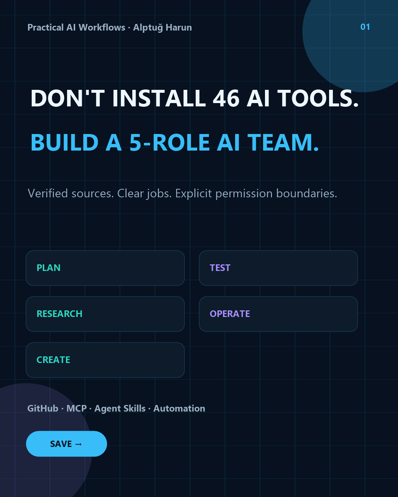

# Verified AI Team Stack

**Do not install 46 things because a carousel told you to. Start with the job, choose the role, verify the source, then install the smallest useful stack.**

This catalog is a practical companion to the existing [AI Creator Stack](AI-CREATOR-STACK.md). The Creator Stack is a reference map. This file is a **selection and verification layer**.

Checked: **2026-10-04**

## What this adds

Every item includes:

- role and layer;
- upstream repository;
- source type: official, vendor, community or maintainer;
- when to use it;
- when not to use it;
- first useful result;
- permission warning;
- cost note;
- evidence level;
- install/docs reference.

The machine-readable source is [ai-team-stack.json](ai-team-stack.json). Campaign visuals are available in [English and Turkish](../docs/assets/ai-team-stack/README.md); English is the canonical GitHub/global-developer variant.

The CLI is dependency-free:

    python tools/ai_team_stack.py check
    python tools/ai_team_stack.py list
    python tools/ai_team_stack.py show playwright-mcp
    python tools/ai_team_stack.py recommend --lane coding_core
    python tools/ai_team_stack.py recommend --lane creator_core

## Evidence labels

**repo_verified** — The repository, maintainer identity and current public metadata were checked. It is **not** a claim that we ran the tool in every host.

**local_ci_verified** — The local project path has deterministic tests/CI. It is not independent adoption evidence.

**maintainer_runtime_verified** — The maintainer reproduced the stated runtime/tool path and recorded that separately.

These labels stop “exists on GitHub” from silently turning into “works perfectly everywhere.”

## Minimum 5 — coding team

1. **Superpowers** — methodology & orchestration
2. **GitHub MCP Server** — repository operations
3. **Playwright MCP** — browser verification
4. **Context7** — current documentation context
5. **AI Workbench MCP** — reusable prompts and assistant blueprints

Run: `python tools/ai_team_stack.py recommend --lane coding_core`

Why this combination: **plan → repository → browser test → current docs → reusable AI job** without pretending you need a giant multi-agent platform.

## Minimum 5 — creator/ops team

1. **AI Social Media Toolkit** — creator workflow layer
2. **AI Workbench MCP** — reusable prompt/assistant layer
3. **Firecrawl MCP Server** — bounded web research/extraction
4. **Notion MCP Server** — knowledge/documentation
5. **Composio** — broader app integrations when one direct connector is not enough

Run: `python tools/ai_team_stack.py recommend --lane creator_core`

Why this combination: **workflow → reusable AI job → research → knowledge → integrations** while keeping the broad integration surface until the end.

## Reference catalog

| Project | Role | Source | Evidence |
| --- | --- | --- | --- |
| [Superpowers](https://github.com/obra/superpowers) | Methodology & orchestration | community | repo verified |
| [Taskmaster](https://github.com/eyaltoledano/claude-task-master) | Task planning & execution | community | repo verified |
| [i-have-adhd](https://github.com/ayghri/i-have-adhd) | Focus & output quality | community | repo verified |
| [Playwright MCP](https://github.com/microsoft/playwright-mcp) | Browser verification | official | repo verified |
| [GitHub MCP Server](https://github.com/github/github-mcp-server) | Repository operations | official | repo verified |
| [Context7](https://github.com/upstash/context7) | Current documentation context | vendor | repo verified |
| [Firecrawl MCP Server](https://github.com/firecrawl/firecrawl-mcp-server) | Web research & extraction | official | repo verified |
| [Notion MCP Server](https://github.com/makenotion/notion-mcp-server) | Knowledge & documentation | official | repo verified |
| [Netlify MCP](https://github.com/netlify/netlify-mcp) | Deployment & operations | official | repo verified |
| [Composio](https://github.com/ComposioHQ/composio) | App integrations | vendor | repo verified |
| [awesome-gpt-image-2](https://github.com/freestylefly/awesome-gpt-image-2) | Visual prompt systems | community | repo verified |
| [Awesome Agents](https://github.com/kyrolabs/awesome-agents) | Discovery | community | repo verified |
| [AI Social Media Toolkit](https://github.com/alptugharun/ai-social-media-toolkit) | Creator operations | maintainer | local CI verified |
| [AI Workbench MCP](https://github.com/alptugharun/ai-workbench-mcp) | Reusable AI jobs | maintainer | maintainer runtime verified |

## Patterns learned from high-velocity repositories

### Superpowers
- one strong methodology instead of a random feature pile;
- automatic triggering;
- cross-harness installation;
- exact install commands for each host;
- clear “what happens next” workflow.

### Taskmaster
- obvious painkiller job;
- one-click/fast install surfaces;
- docs separated from README;
- package/download signals;
- product funnel beyond GitHub.

### i-have-adhd
- memorable name;
- one specific pain;
- outcome visible in one sentence;
- tiny install request;
- before/after value that is easy to share.

### awesome-gpt-image-2
- visual proof;
- hundreds of browsable examples;
- structured assets instead of prose only;
- live website;
- sponsorship and affiliate monetization without hiding the free core.

### Watabou
- each project does one visual job;
- live result is more important than a long README;
- old useful tools keep earning attention for years;
- consistency across a family of small products compounds profile discovery.

## Our rule

We will use those patterns, not copy their branding or code.

For a new public asset to earn a place here it should answer:

1. What job is obvious in ten seconds?
2. What is the first result?
3. Can the user try it quickly?
4. What permission/cost boundary exists?
5. What did we actually verify?
6. What failure should the user expect first?
7. Why should someone return?
8. Is it strong enough to be a product, or should it stay inside the toolkit?

## Monetization rule

The free core must remain useful.

Monetization belongs around:

- implementation;
- customization;
- maintained team stacks;
- private installation/support;
- sponsored placements that are clearly labeled;
- affiliate links only when the product is genuinely relevant and disclosure is explicit;
- premium templates/workspaces that remove setup work rather than hiding basic knowledge.

**Traffic first. Reuse second. Buyer signal third. Productize after evidence.**
